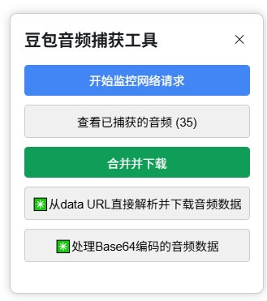
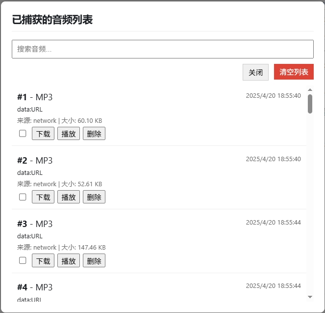
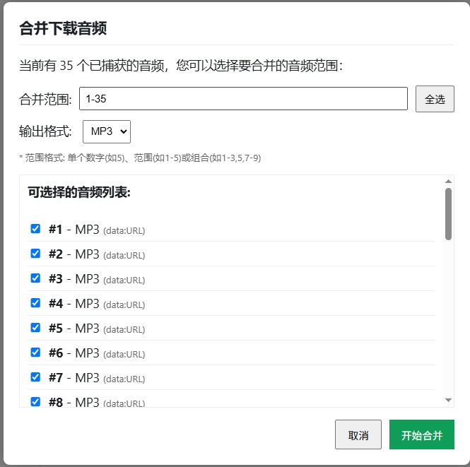

# 豆包网页版音频捕获工具

一个用于捕获豆包网页版(doubao.com)中音频数据的油猴脚本，支持直接下载单个音频或合并多个音频。

## ✨ 功能特点

- 💾 自动捕获网页中的所有音频数据
- 🔍 监控网络请求获取音频流
- 🎧 支持预览、下载单个音频文件
- 🔄 支持合并多个音频为一个文件
- 🔢 处理Base64编码的音频数据
- 📋 音频列表管理(搜索、删除、清空)
- 💽 支持MP3和WAV格式导出

## 📥 安装方法

### 方式一：从GreasyFork安装

1. 安装 [Tampermonkey](https://www.tampermonkey.net/) 或其他用户脚本管理器
2. 前往 [GreasyFork页面](https://greasyfork.org/scripts/[脚本ID]) 安装脚本

### 方式二：从GitHub安装

1. 安装 [Tampermonkey](https://www.tampermonkey.net/) 或其他用户脚本管理器
2. 点击此仓库中的 [doubao-audio-capture.user.js](./doubao-audio-capture.user.js) 文件
3. 点击 "Raw" 按钮查看源代码
4. Tampermonkey 会自动提示安装

## 🚀 使用指南

### 基本操作

1. 安装脚本后访问 [豆包网页版](https://www.doubao.com/)
2. 页面右下角会出现音频捕获工具面板
3. 点击"开始监控网络请求"按钮
4. 与豆包AI对话，让其生成语音回复
5. 工具会自动捕获这些音频

### 音频合并

1. 捕获多个音频后，点击"查看已捕获的音频"
2. 点击"合并并下载"按钮
3. 选择要合并的音频范围和输出格式
4. 点击"开始合并"等待完成

### 工具面板按钮说明

| 按钮 | 功能 |
|------|------|
| 开始/停止监控网络请求 | 切换监控状态 |
| 查看已捕获的音频 | 显示音频列表 |
| 合并并下载 | 合并多个音频 |
| 从data URL直接下载 | 下载复制的data URL格式音频 |
| 处理Base64数据 | 处理复制的Base64编码音频 |

## 🖼️ 截图展示

## 💡 技术实现

- 拦截XHR和Fetch请求捕获音频数据
- 使用lamejs库进行MP3编码
- 监控DOM变化捕获新添加的媒体元素
- 采用直接MP3文件拼接方式提高合并效率

## 🔍 常见问题

**Q: 为什么有时捕获不到音频？**  
A: 确保点击了"开始监控网络请求"按钮，并且音频是通过网络请求加载的。

**Q: 合并音频很慢怎么办？**  
A: 尝试选择较少的文件数量，或者只合并MP3格式文件（直接拼接更快）。

**Q: 如何查找之前捕获的音频？**  
A: 脚本会自动保存元数据，下次打开网页时可以在"查看已捕获的音频"中看到历史记录。

## 📝 更新日志

### v1.0.0 (初始版本)
- 实现基本音频捕获功能
- 支持音频合并与下载
- 添加音频列表管理

## ⚖️ 许可证

本项目采用 [MIT 许可证](LICENSE) 进行许可。

## ⚠️ 免责声明

此脚本仅用于个人学习和研究用途。使用本脚本时，请遵守相关法律法规，尊重版权。使用者需自行承担使用本脚本的一切后果。

## 🤝 贡献

欢迎提交Issue或Pull Request来改进此脚本！